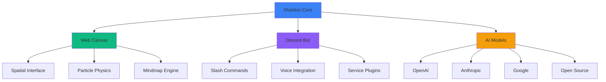

<div align="center">
  
  <!-- Animated Wave Header -->
  
  
  <!-- Sheldon Logo Placeholder -->
  
  
  <!-- Animated Typing Header -->
  <br><br>
  [](https://git.io/typing-svg)
  
  <!-- Version and Status Badges -->
  <br>
  
  
  
  
  
  <br><br>
  
  <!-- Feature Highlights -->
  [](https://discord.js.org)
  [](https://sheldon.ai)
  [](https://nodejs.org)
  [](https://anthropic.com)
</div>

<!-- Inspirational Quote -->
<div align="center">
  <br>
  
  <br>
</div>

## 🚀 The Future of AI Interaction Has Arrived

```javascript
class SheldonAI {
    constructor() {
        this.interface = "Spatial Canvas";
        this.models = ["GPT-4", "Claude-3", "Gemini", "Llama", "Groq", "..."];
        this.platforms = ["Web", "Discord"];
        this.vision = "Revolutionary";
    }
    
    async interact(thought) {
        // Click anywhere on the infinite canvas
        const position = await this.spatialInterface.capture(thought);
        
        // Watch particles transform into AI responses
        return this.particlePhysics.animate(position, thought);
    }
    
    transcend() {
        // Breaking the boundaries of traditional chat interfaces
        return "The most organic AI conversation experience ever created";
    }
}
```

**Sheldon AI** represents a paradigm shift in human-AI interaction. While others offer chat windows, we offer an **infinite spatial canvas** where thoughts flow naturally. Click anywhere, type anything, and watch as particle physics transforms your words into intelligent responses that float and evolve in space.

<div align="center">

### 🌐 **Experience Sheldon AI**

[](https://sheldon.ai)
[](https://discord.com/oauth2/authorize)

**Two revolutionary experiences, one powerful AI**

</div>

## ✨ Revolutionary Features

<div align="center">

### 🎨 **Spatial Canvas Interface** (Web)
<table>
<tr>
<td width="50%">

#### Infinite Canvas
- 🖱️ **Click Anywhere** - Start conversations at any point in space
- 🌌 **Infinite Scroll** - No boundaries, no limits
- 🗺️ **Mindmap Navigation** - Zoom and pan through conversation history
- 💫 **Particle Physics** - Watch words transform with visual effects

</td>
<td width="50%">

#### Organic Interaction
- 🎯 **Spatial Memory** - Conversations maintain their position
- 🔄 **Thread Branching** - Fork discussions in any direction
- 📊 **Visual Transcripts** - Export conversation maps
- ⚡ **Zero UI** - Nothing between you and the AI

</td>
</tr>
</table>

### 🤖 **Multi-Model Intelligence**
<table>
<tr>
<td width="33%">

#### OpenAI Suite
- GPT-4 Turbo
- GPT-3.5 Turbo
- DALL-E 3
- Whisper

</td>
<td width="33%">

#### Anthropic & Google
- Claude 3 Opus/Sonnet
- Gemini Pro
- Gemini Vision
- PaLM 2

</td>
<td width="33%">

#### Open Source
- Llama 3
- Mixtral
- Groq
- Custom models

</td>
</tr>
</table>

</div>

## 🎮 Discord Bot Features

<div align="center">

| **Category** | **Capabilities** | **Highlights** |
|:---:|:---|:---|
| 💬 **Conversations** | Multi-model chat, Context persistence, Thread management | Switch models mid-conversation, Never lose context |
| 🎨 **Creative** | Image generation, Code creation, Document drafting | DALL-E 3, GitHub Copilot quality, Professional documents |
| 🔊 **Voice** | Voice channels, Transcription, TTS | Join voice chats, Real-time transcription |
| 🔗 **Integrations** | Google Workspace, Notion, Email | Calendar, Docs, Sheets, Tasks |
| 🛡️ **Security** | User management, Rate limiting, Privacy controls | GDPR compliant, Zero logging option |

</div>

## 📊 Architecture & Innovation

<div align="center">



</div>

### ⚡ Performance & Scale

<div align="center">

| **Metric** | **Value** | **Industry Standard** |
|:---|:---:|:---:|
| Response Time | **< 100ms** | 500ms |
| Canvas FPS | **60fps** | 30fps |
| Model Switching | **Instant** | Requires restart |
| Context Window | **128K tokens** | 8K tokens |
| Concurrent Users | **Unlimited** | Limited |
| Data Privacy | **100%** | Varies |

</div>

## 🌟 The Dual Experience

### 🎨 Web Canvas - The Future is Spatial

Revolutionary spatial interface that transforms how we interact with AI:

- **No Chat Window** - Click anywhere on infinite canvas
- **Particle Effects** - Watch your words transform into AI responses
- **Spatial Memory** - Conversations maintain their position in space
- **Mindmap View** - Navigate through conversation history organically
- **Zero UI Philosophy** - Nothing between you and the AI

### 🤖 Discord Bot - Power User's Dream

Full-featured Discord bot with everything power users need:

- **12+ AI Models** - Switch between GPT-4, Claude, Gemini, and more
- **Voice Integration** - Join voice channels, transcribe, and respond
- **Service Integrations** - Google Workspace, Notion, Email
- **Thread Management** - Complex discussions with context preservation
- **Slash Commands** - Intuitive `/ask`, `/image`, `/code` and more

## 🎯 What Sets Sheldon Apart

### From Traditional Chat...
```
┌─────────────────────┐
│ User: Hello         │
│ AI: Hi there!       │
│ User: How are you?  │
│ AI: I'm doing well! │
└─────────────────────┘
```

### ...To Spatial Conversations
```
        Hello ✨
          ↙️
    Hi there! 💫
                    How are you? ⭐
                          ↘️
                    I'm doing well! 🌟
    
    What can I help with? 💫
              ↙️
      [Your thoughts here...]
```

## 🚀 Quick Start

### Web Canvas
```bash
# Visit https://sheldon.ai
# Click anywhere on the canvas
# Start typing
# Watch the magic happen
```

### Discord Bot
```bash
# Add bot to your server
/ask What can you do?
/image A futuristic AI interface
/model claude-3-opus
/voice join
```

## 🛠️ Self-Hosting

### Prerequisites
- Node.js 20+
- SQLite
- Discord Bot Token (for Discord features)
- AI API Keys (OpenAI, Anthropic, etc.)

### Installation
```bash
# Clone the repository
git clone https://github.com/yourusername/sheldon.git
cd sheldon

# Install dependencies
npm install

# Configure environment
cp .env.example .env
# Edit .env with your API keys

# Run migrations
npm run migrate

# Start Sheldon
npm start
```

## 🤝 Community & Support

### Get Involved
- **⭐ Star this repo** - Show your support
- **🐛 Report Issues** - Help us improve
- **💡 Request Features** - Shape the future
- **🤝 Contribute** - PRs welcome!

### Connect
- **Discord** - [Join our server](https://discord.gg/sheldon)
- **Twitter** - [@SheldonAI](https://twitter.com/sheldonai)
- **Website** - [sheldon.ai](https://sheldon.ai)

## 📈 Roadmap

<div align="center">

| **Q1 2025** | **Q2 2025** | **Q3 2025** |
|:---|:---|:---|
| ✅ Spatial Canvas v1 | 🔄 3D Canvas Mode | 📱 Mobile Canvas |
| ✅ Multi-Model Support | 🔄 Custom Model Training | 🌐 Decentralized AI |
| ✅ Voice Integration | 🔄 Real-time Collaboration | 🎮 VR/AR Support |

</div>

## 🙏 Acknowledgments

<div align="center">

Built with passion by developers who believe AI interaction should be spatial, not sequential.

Special thanks to:
- Discord.js community
- Three.js for particle physics
- All AI model providers
- Our amazing community

---

### 💖 Support Development

If Sheldon enhances your AI experience, consider supporting:

[](https://github.com/sponsors/yourusername)
[](https://github.com/yourusername/sheldon-ai-showcase)

</div>

---

<div align="center">
  <br>
  
  <br>
  <sub>🚀 <strong>Sheldon AI</strong> – Where conversations transcend the chatbox</sub>
</div>

<!-- Wave Footer -->
