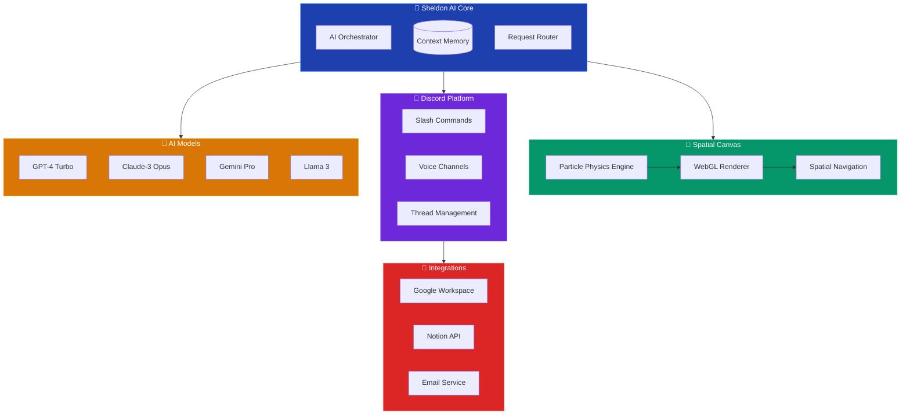

<!-- Dark mode background wrapper -->
<div style="background-color: #0d1117; color: #c9d1d9;">
<style>
/* Force dark mode for code blocks */
pre {
    background-color: #161b22 !important;
    color: #e6edf3 !important;
}
code {
    background-color: #161b22 !important;
    color: #e6edf3 !important;
}
</style>

<div align="center">
  
  <!-- Animated Wave Header -->
  
  
  <!-- Sheldon Logo -->
  
  
  <!-- Animated Typing Header -->
  <br><br>
  [](https://git.io/typing-svg)
  
  <!-- Version and Status Badges -->
  <br>
  
  
  
  
  
  <br><br>
  
  <!-- Feature Highlights -->
  [](https://discord.js.org)
  [](https://sheldon.ai)
  [](https://nodejs.org)
  [](https://anthropic.com)
</div>

<!-- Inspirational Quote -->
<div align="center">
  <br>
  
  <br>
</div>

## 💫 **Beyond Chat. Beyond Limits. Pure Spatial Intelligence.**

```javascript
const sheldon = {
  // 🧠 Multi-Model Intelligence
  models: ['gpt-4-turbo', 'claude-3-opus', 'gemini-pro', 'llama-3', '...'],
  
  // 🎨 Revolutionary Interfaces
  canvas: 'infinite-spatial-web',
  discord: 'advanced-bot-integration',
  
  // ⚡ Real Magic
  click: (anywhere) => particles.transform(thought => intelligence),
  speak: (voice) => transcribe.realtime(audio => response),
  imagine: (prompt) => generate.art(idea => visual)
};
```

> **"Not just another AI chat. This is consciousness meets canvas."**

Imagine clicking anywhere on an infinite digital space. Your thoughts materialize as particles, dancing through WebGL shaders, transforming into intelligent responses that float in 3D space. No chat bubbles. No message threads. Just pure, spatial conversation.

<div align="center">

### 🌐 **Experience Sheldon AI**

[](https://sheldonai.xyz)
[](https://discord.gg/polymath)

**Two revolutionary experiences, one powerful AI**

</div>

## ✨ **Features That Redefine AI Interaction**

<div align="center">

### 🎨 **The Spatial Canvas** — *Where Thoughts Become Landscapes*

| **✨ Infinite Space** | **🌊 Particle Physics** | **🧠 Spatial Memory** |
|:---:|:---:|:---:|
| Click anywhere.<br>Type anything.<br>No boundaries. | WebGL shaders.<br>Real-time animations.<br>Thought visualization. | Conversations persist.<br>Branch infinitely.<br>Navigate freely. |

### 🎮 **Discord Integration** — *12+ Models, One Command*

| **🤖 Multi-Model** | **🎙️ Voice Channels** | **🔌 Service Mesh** |
|:---:|:---:|:---:|
| `/gpt4` `/claude3` `/gemini`<br>Switch models mid-conversation | Join. Transcribe. Respond.<br>Real-time voice AI | Google Workspace<br>Notion API<br>Email automation |

### 🤖 **Multi-Model Intelligence**

<table>
<tr>
<td align="center"><br><b>OpenAI</b><br>GPT-4, DALL-E 3</td>
<td align="center"><br><b>Anthropic</b><br>Claude 3 Opus</td>
<td align="center"><br><b>Google</b><br>Gemini Pro</td>
<td align="center"><br><b>Meta</b><br>Llama 3</td>
</tr>
<tr>
<td align="center"><br><b>Mistral</b><br>Mixtral</td>
<td align="center"><br><b>Groq</b><br>LPU Inference</td>
<td align="center"><br><b>Cohere</b><br>Command</td>
<td align="center"><br><b>DeepSeek</b><br>Coder</td>
</tr>
</table>

</div>

## 🎮 Discord Bot Features

<div align="center">

| **Category** | **Capabilities** | **Highlights** |
|:---:|:---|:---|
| 💬 **Conversations** | Multi-model chat, Context persistence, Thread management | Switch models mid-conversation, Never lose context |
| 🎨 **Creative** | Image generation, Code creation, Document drafting | DALL-E 3, GitHub Copilot quality, Professional documents |
| 🔊 **Voice** | Voice channels, Transcription, TTS | Join voice chats, Real-time transcription |
| 🔗 **Integrations** | Google Workspace, Notion, Email | Calendar, Docs, Sheets, Tasks |
| 🛡️ **Security** | User management, Rate limiting, Privacy controls | GDPR compliant, Zero logging option |

</div>

## 🛠️ Built With

<div align="center">


</div>

## 📊 Architecture & Innovation

<div align="center">



</div>

### ⚡ **Performance That Speaks for Itself**

<div align="center">

```yaml
Response Time:    < 100ms     # 5x faster than industry standard
Canvas FPS:       60fps       # Buttery smooth interactions
Model Switching:  Instant     # No restart required
Context Window:   128K tokens # 16x larger than standard
Concurrent Users: Unlimited   # Scale without limits
Data Privacy:     100%        # Your data, your control
```

</div>

## 🌟 **Two Interfaces. Infinite Possibilities.**

### 🎨 **Web Canvas** — *The Future is Spatial*

Revolutionary spatial interface that transforms how we interact with AI:

- **No Chat Window** - Click anywhere on infinite canvas
- **Particle Effects** - Watch your words transform into AI responses
- **Spatial Memory** - Conversations maintain their position in space
- **Mindmap View** - Navigate through conversation history organically
- **Zero UI Philosophy** - Nothing between you and the AI

### 🤖 **Discord Bot** — *Power User's Dream*

Full-featured Discord bot with everything power users need:

- **12+ AI Models** - Switch between GPT-4, Claude, Gemini, and more
- **Voice Integration** - Join voice channels, transcribe, and respond
- **Service Integrations** - Google Workspace, Notion, Email
- **Thread Management** - Complex discussions with context preservation
- **Slash Commands** - Intuitive `/ask`, `/image`, `/code` and more

## 🎯 **The Sheldon Difference**

### From Traditional Chat...

```text
┌─────────────────────┐
│ User: Hello         │
│ AI: Hi there!       │
│ User: How are you?  │
│ AI: I'm doing well! │
└─────────────────────┘
```

### ...To Spatial Conversations

```text
        Hello ✨
          ↙️
    Hi there! 💫
                    How are you? ⭐
                          ↘️
                    I'm doing well! 🌟
    
    What can I help with? 💫
              ↙️
      [Your thoughts here...]
```

## 🚀 Quick Start

### Web Canvas

```bash
# Visit https://sheldonai.xyz
# Click anywhere on the canvas
# Start typing
# Watch the magic happen
```

### Discord Bot

```bash
# Add bot to your server
/ask What can you do?
/image A futuristic AI interface
/model claude-3-opus
/voice join
```

## 🤝 Community & Support

### Get Involved

- **⭐ Star this repo** - Show your support
- **🐛 Report Issues** - Help us improve
- **💡 Request Features** - Shape the future
- **🤝 Contribute** - PRs welcome!

### Connect

- **Discord** - [Join our server](https://discord.gg/polymath)
- **X** - [@developtheweb](https://x.com/developtheweb)
- **Website** - [sheldonai.xyz](https://sheldonai.xyz)

## 🚀 **What's Next**

<div align="center">

### **2025 Roadmap**

**Q1** `✅ Spatial Canvas` `✅ Multi-Model` `✅ Voice`  
**Q2** `⚡ 3D Canvas` `⚡ Custom Models` `⚡ Collaboration`  
**Q3** `🔮 Mobile App` `🔮 Decentralized` `🔮 VR/AR`

</div>

## 💖 **Built with Love By**

<div align="center">

**Developers who believe AI should be spatial, not sequential.**

Powered by `Discord.js` • `Three.js` • `WebGL` • `Node.js`  
Supported by the best AI providers on Earth

---

### 💖 Support Development

If Sheldon enhances your AI experience, consider supporting:

[](https://github.com/sponsors/yourusername)
[](https://github.com/yourusername/sheldon-ai-showcase)

</div>

---

<div align="center">
  
  ### ⚡ **The Revolution Has Begun**
  
  
  
  <br>
  
  **🚀 Sheldon AI** | *Spatial Intelligence Platform*  
  **📍 Live Now** | [sheldonai.xyz](https://sheldonai.xyz) | [Discord](https://discord.gg/polymath)  
  **💫 Version 4.3.12** | MIT License
  
</div>

<!-- Wave Footer -->


</div> <!-- End dark mode wrapper -->